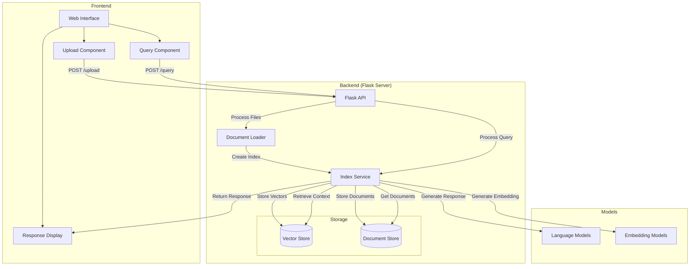
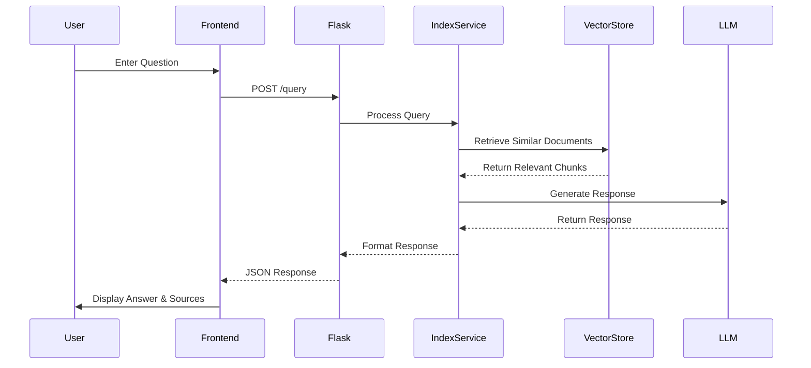
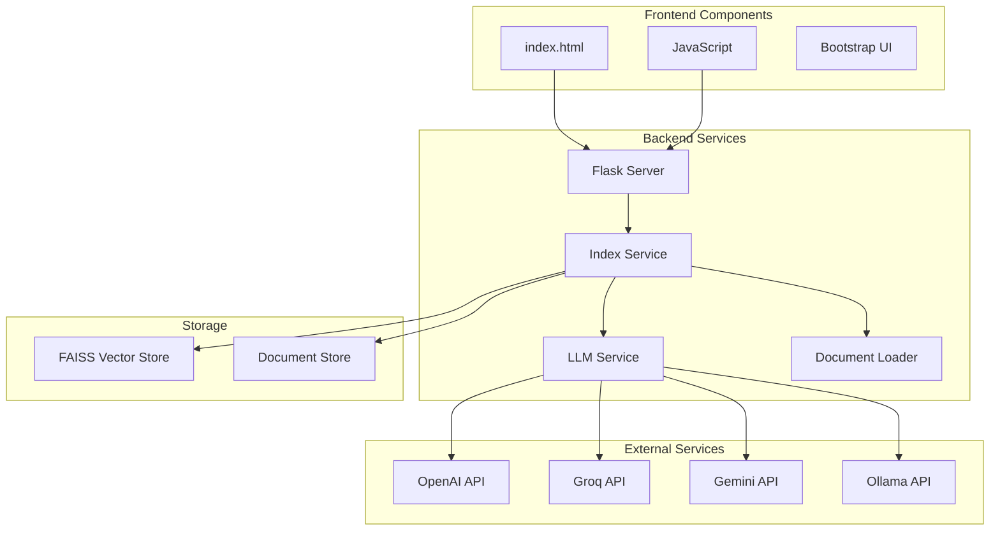

# RAG Application with Flask and Llama Index

The simple RAG application written in Python and it also a web application that allows users to upload banking documents and ask questions about them. The application uses a combination of Flask, Llama Index, and various language models to process documents and provide answers to user queries.

## Features

- Upload and process PDF, TXT, and JSON documents.
- Ask questions about the uploaded documents.
- Choose from different response styles for answers.
- View sources and relevance scores for each response.

## Architecture

### Overall System Flow



### Query Process Flow



### Component Architecture



The diagrams above illustrate:

1. **Overall System Flow**: Shows how the frontend interacts with the backend services and how data flows through the system during document upload and querying.

2. **Query Process Flow**: Details the sequence of operations that occur when a user submits a question, from frontend to backend and back.

3. **Component Architecture**: Displays the relationship between different components of the system, including frontend, backend services, external APIs, and storage systems.

Key components:

- Frontend web interface with upload and query capabilities
- Flask backend server handling API requests
- Index Service managing document processing and retrieval
- Multiple LLM providers (OpenAI, Groq, Gemini, Ollama)
- Vector and Document storage systems

## Installation

### Prerequisites

- Python 3.13 or higher
- Virtual environment (recommended)

### Setup

1. Clone the repository:

   ```bash
   git clone https://github.com/sha0h0ng/simple_rag_app.git
   cd simple_rag_app
   ```

2. Create and activate a virtual environment:

   ```bash
   python -m venv venv
   source venv/bin/activate  # On Windows use `venv\Scripts\activate`
   ```

3. Install the required packages:

   ```bash
   pip install -r requirements.txt
   ```

4. Set up environment variables:

   - Copy `.env.template` to `.env` and fill in your API keys.

5. Run the application:

   ```bash
   python app.py
   ```

6. Open your browser and go to `http://localhost:5050` to access the application.

## Configuration

### `config.py` Details

The `config.py` file is crucial for setting up the environment and configuring the behavior of the application. Below are the key configurations:

- **API Keys**: The file loads API keys from the environment using `python-dotenv`. Ensure your `.env` file contains valid keys for `OPENAI_API_KEY`, `GROQ_API_KEY`, and `GEMINI_API_KEY`.

- **LLM and Embedding Providers**:

  - `LLM_PROVIDER`: Specifies the language model provider. Options include `openai`, `ollama`, etc.
  - `EMBEDDING_PROVIDER`: Specifies the embedding model provider.

- **Document Processing Settings**:

  - `CHUNK_SIZE`: Defines the size of document chunks for processing.
  - `CHUNK_OVERLAP`: Sets the overlap size between chunks to ensure context continuity.

- **Embedding Model**: Uncomment the desired model to use for embeddings. Options include OpenAI, Ollama, and HuggingFace models.

- **LLM Model**: Specifies the language model to use, such as `gpt-4o-mini` for OpenAI or `llama3.2:latest` for Ollama.

- **QA Templates**: Customize the response styles by modifying the QA templates. Each template provides a different style of response, such as `DEFAULT_QA_TEMPLATE`, `PROFESSIONAL_QA_TEMPLATE`, etc.

### Customization

You can modify the `config.py` file to change the behavior of the application, such as switching between different language models or adjusting document processing parameters.


The diagrams above illustrate:

1. **Overall System Flow**: Shows how the frontend interacts with the backend services and how data flows through the system during document upload and querying.

2. **Query Process Flow**: Details the sequence of operations that occur when a user submits a question, from frontend to backend and back.

3. **Component Architecture**: Displays the relationship between different components of the system, including frontend, backend services, external APIs, and storage systems.

Key components:

- Frontend web interface with upload and query capabilities
- Flask backend server handling API requests
- Index Service managing document processing and retrieval
- Multiple LLM providers (OpenAI, Groq, Gemini, Ollama)
- Vector and Document storage systems

## Usage

1. Start the application by running `python app.py`.
2. Open your browser and go to `http://localhost:5050` to access the application.
3. **Upload Documents**: Drag and drop or browse to select PDF, TXT, or JSON files to upload.
4. **Ask Questions**: Enter your question in the provided text area and select a response style.
5. **View Responses**: The application will display the answer along with the sources and relevance scores.

## NOTE!

Please note that this is for development purposes only. In a production environment, you should restrict CORS to specific origins.

## License

This project is licensed under the MIT License. See the [LICENSE](LICENSE) file for details.

## Acknowledgments

- [Flask](https://flask.palletsprojects.com/)
- [Llama Index](https://llama-index.readthedocs.io/)
- [Langchain](https://langchain.com/)
- [Bootstrap](https://getbootstrap.com/)
